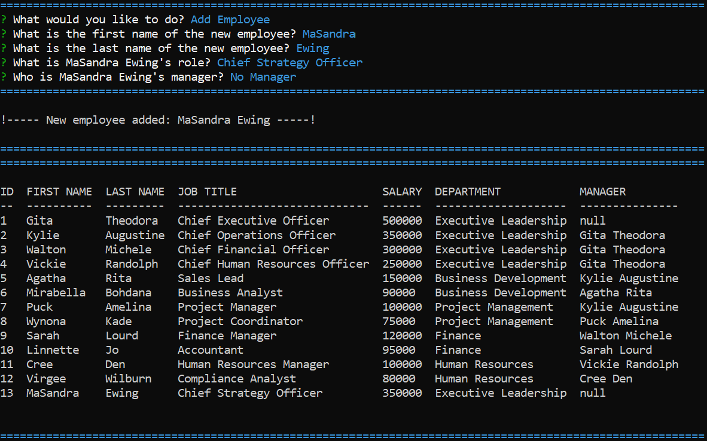

# eManage
[](https://opensource.org/licenses/MIT)

## Description
Command-line application to manage a company's employee database, using Node.js, Inquirer, Express, Chalk, and MySQL.

## Table of Contents
[1. Installation](#installation)

[2. Usage](#usage)

[3. Demo](#demo)

[4. Contributing](#contributing)

[5. Questions](#questions)

[6. License](#license)

[7. Screenshots](#screenshots)

[8. Credits](#credits)

<br></br>

## Installation 
The application has dependencies (see package.json file). Before using the application, install npm modules.

```bash
npm install
```

## Usage 
The application will be invoked by using the following command:

```bash
node index.js
```

```
The application enables a user to:
- view departments, a department's budget, roles, and employees in the company
- add a departments, roles, and employees to a database
- update an employee's role in the database

```

## Demo
[Link for demo video](https://watch.screencastify.com/v/oQx2UiusGCq61tafIFtZ) (Length of video: 4 minutes and 25 seconds)

The video is also within the assets folder.
```
A walkthrough video demonstrates: 
- the functionality of the employee tracker 
- all of the technical acceptance criteria being met
- how a user would invoke the application from the command line
- a functional menu with the options outlined in the usage section
```

## Contributing 
Contributions are welcomed for future versions with features such as:
- update employee managers, view employees by manager, view employees by department, and delete departments or roles or employees
- additional enhancements

For all contributions, please refer to [Contributor Covenant Code of Conduct](https://www.contributor-covenant.org/version/2/1/code_of_conduct/code_of_conduct.md) for contributing guidelines.


## Questions
Interested in seeing my other work?

Check out my GitHub account: [mewing0328](https://github.com/mewing0328).

If you have additional questions, please reach me at [masandraewing@gmail.com](mailto:masandraewing@gmail.com).

## License 
eManage project is covered by MIT license. 

 To view the most current and full license description in opensource.org, click on the license name below.  

 [](https://opensource.org/licenses/MIT)

 ## Screenshots 
Images of different menu options

1. View Budget By Department

    

2. View All Departments

    

3. View All Roles

    

4. View All Employees

    

5. Add Department

    

6. Add Role

    

7. Add Employee

    

8. Update Employee Role

    

9. Close Application

    

## Credits
Credit for tutorials and guides I utilized in my code

[npm](https://docs.npmjs.com/creating-a-package-json-file): How to create a package.json file.

[npm](https://remarkablemark.org/blog/2021/08/28/how-to-create-npm-package-lockfile/): How to create a package-lock.json

[npm: mysql2](https://www.npmjs.com/package/mysql2): Promises examples.

[npm: chalk](https://www.npmjs.com/package/chalk?activeTab=readme): For styling the terminal console.log

[Inquirer Package](https://www.npmjs.com/package/inquirer/v/8.2.4#examples): To get user inputs

[MySQL2 Package](https://www.npmjs.com/package/mysql2): To connect to a MySQL database

[console.table Package](https://www.npmjs.com/package/console.table): To print MySQL rows to the console

[JSHint Package](https://www.npmjs.com/package/jshint): To detect errors and potential problems in JavaScript

[Recursive Key](https://assets.ctfassets.net/kdr3qnns3kvk/MlzrannWSaE6qWOsquqwa/34c2afb04f1e55aaa7c9f73b8c41ecf7/chapt06.pdf): How to reference the employeeID as the managerID

[w3resource.com](https://www.w3resource.com/sql-exercises/movie-database-exercise/joins-exercises-on-movie-database.php): Tutorials for different SQL examples

[mysqltutorial.org](https://www.mysqltutorial.org/mysql-nodejs/insert/): How to add a new row to a SQL table with an inquirer answer

[suvarna28 GitHub](https://github.com/suvarna28): utilized her approach for self referencing the employees table to get manager name. Altered her approach to use NATURAL JOIN as well

[stackoverflow.com](https://stackoverflow.com/questions/6054368/null-value-for-int-in-update-statement): Article discussing null as an INT data type so no need for quotes when assigning null to an array row

[behindthename.com](https://www.behindthename.com/random): Random name generator for table data